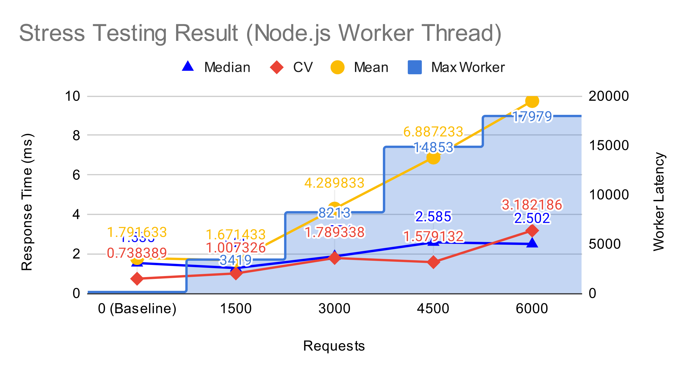
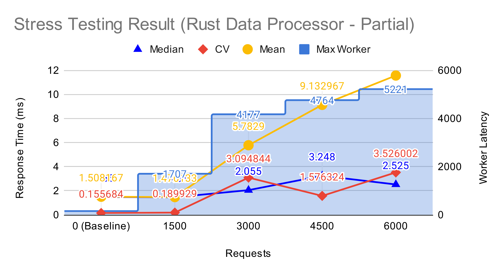
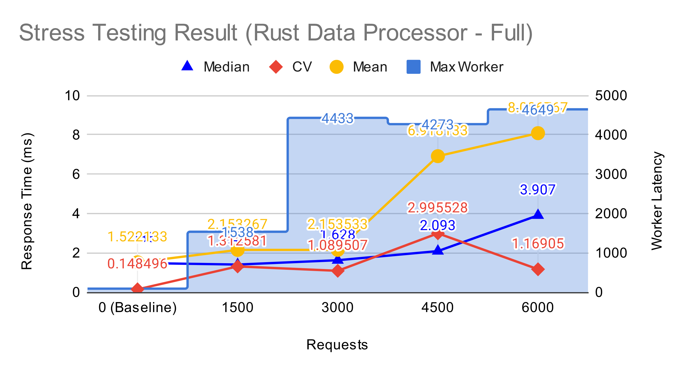

# Deploy With External Data Processor

- [Deploy With External Data Processor](#deploy-with-external-data-processor)
  - [Rust-based Data Processor](#rust-based-data-processor)
  - [Performance](#performance)
  - [Notes](#notes)


## Rust-based Data Processor
Currently, we only have an implementation of the Data Processor written in Rust.  
To use it, you have to use the purposely built image (for now): `reg.stw.tw/kmamiz:rust-dp`  
A deployment template can be found in [kmamiz-rust-sample.yaml](./kmamiz-rust-sample.yaml)

Just like the original deployment, you have to provide the MongoDB URI. If you want to change the port, follow the instructions in the original deployment documentation.
```yaml
            - name: MONGODB_URI
              value: "{your-mongodb-uri}" # <-- change this
```

The current Rust-based implementation provides a few options that can be adjusted using environment variables.
```yaml
          env:
            - name: RUST_LOG
              # accept: error | warn | info | debug | trace
              # see: https://docs.rs/env_logger/latest/env_logger/
              value: "kmamiz_data_processor=debug,info"
            - name: BIND_IP
              value: "127.0.0.1"
            - name: PORT
              value: "8000"
            - name: ZIPKIN_URL
              value: "http://zipkin.istio-system:9411"
            - name: IS_RUNNING_IN_K8S
              value: "true"
```
- `RUST_LOG` - see: https://docs.rs/env_logger/latest/env_logger
- `BIND_IP` - The IP address Actix binds on.
- `PORT` - The port Actix listens on.
- `ZIPKIN_URL` - Zipkin URL, same as the one in KMamiz's environment settings.
- `IS_RUNNING_IN_K8S` - Must be `true` inside a Kubernetes cluster and `false` otherwise. This variable controls whether to use the authenticated APIs.

## Performance
To measure the performance using the external data processor, I conduct a series of stress testing on PDAS and record the results.

This is the result using the Node.js worker process:


This is the result of #1.


This is the result of #2.


We can observe that, with an external data processor, KMamiz can provide much more stable API responses. Since the Realtime Schedule is running on an interval of 5 seconds, the performance of the full data processor implementation can deal with a large number of requests without backing off the next interval.

## Notes
> Write time: 2022/03/29, things might have changed.

Here are some notes on the `kmamiz:rust-dp` image:
- This image can run on its own without an external DP. It would just spit out a message about switching to fallback mode.
- Due to some fixes during the development of the Rust-based DP, it would perform slightly better than the current `latest` image.
- I planned to replace the `latest` with this eventually.
