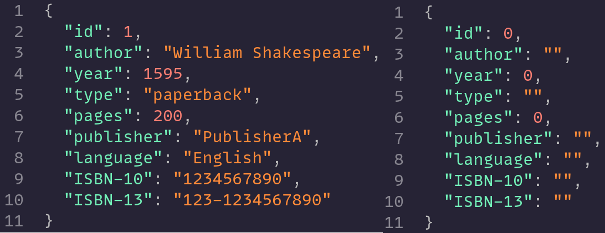

# Architecture

> This document details the architectural design of KMamiz. (Excerpted from the English version paper of KMamiz)

KMamiz is a three-layer application, a frontend SPA, a backend, and a database.

## Overview

The above graph shows the architecture of KMamiz’s internal modules. KMamiz’s APIs are grouped into five routes by their usage. Considering that a large amount of data is constantly flowing in and out of KMamiz, we designed a cache layer to hold all data necessary for runtime. A periodically triggered mechanism does the synchronization between the cache and the database. This mechanism sync one part of the cache at a time to avoid unnecessary interruptions to other features. We evaluated this system architecture and found it can sustain a high traffic load while providing service stably.

## Data processing procedure

KMamiz’s frontend webpage has six main pages, Dependency Graph, Metrics, Insights, Endpoints, Interfaces, and Swagger. The following graph describes the procedures to generate data shown on these six pages. We divided the following diagram into six zones for a better explanation.

- In zone A, KMamiz collects necessary data from Zipkin and Envoy (through Kubernetes API). Traces from Zipkin can merge with logs from Envoy, forming real-time data containing all the information about every recorded request. Every request path will generate unique real-time data, which is unsuitable for further analysis.
- So in zone B, KMamiz creates historical data and its combined form, aggregated data, from real-time data. Historical data contains dynamic service metrics and is visualized on the Metrics page. Aggregated data are pre-combined historical data, making querying the overall performance of service more accessible.
- Real-time data also contains the request and response data schemas of endpoints, which in zone C are used to retrieve endpoint paths and are shown on the Endpoints page.
- KMamiz uses these data schemas and retrieved paths in zone D to create OpenAPI documents presented on the Swagger page using Swagger UI. The data schemas are detailed in the form of Typescript interfaces on the Interfaces page.
- KMamiz extracts endpoint-level dependency from Zipkin’s traces and combining with the retrieved endpoint path from zone C to create endpoint dependency, which can use to display an endpoint-level dependency graph on the Dependency Graph page, as shown in zone F.
- Endpoint-level dependency can be simplified into service-level dependency and is used to create KMamiz’s static metrics shown on the Insights page, as described in zone E.

## Schedules

KMamiz has three main background tasks running on a scheduler:

- Real-time data collecting and processing
- Data aggregation
- Data synchronization

### Real-time data collecting and processing

As shown in the following figure, because data collection and processing require time and computing, KMamiz offloads the work into a worker process. The main process will first decide the time range for data collection and pass it to the worker. The worker process will then gather information from Zipkin and Envoy to create real-time data, endpoint dependency, and endpoint datatype. Finally, the worker passes the newly created data back to the main process to update the existing cache.

### Data aggregation

Real-time data contains a list of every recorded request path, which is unsuitable for producing useful information. KMamiz runs a data aggregation process to create historical and aggregated data from real-time data, as shown in the following figure. These data are structured based on services and can better represent the status of a service. Historical data include the past performance of a service and are used to create real-time metrics graphs on the Metrics page. Aggregated data combines all past information into one, making querying the average performance of service more accessible.

### Data synchronization

KMamiz uses a cache layer to reduce loading on the database. To synchronize the cache layer and the database, KMamiz uses a partial synchronization mechanism, as shown in the following figure. A different part of the cache is synced at an interval to avoid long waiting.

## Endpoint path speculation algorithm

Path variables are widely used in RESTful API design, like the example in the following table. REQ-1 and REQ-2 are different requests to the same endpoint, statistics like requests, errors, and latency of the two requests need to be combined to produce accurate endpoint statistics. However, there are no defined regulations on path variable design, meaning by just looking at the request path, REQ-2 and REQ-3 could be considered the same endpoint and combine to `/api/{}/{}`, although this is a valid API design, it is far from the ground truth. To reduce the occurrence of this error, we design an endpoint speculation algorithm based on endpoint request and response schema and string matching.

| ID    | True Path                  | Request Path            |
| ----- | -------------------------- | ----------------------- |
| REQ-1 | `/api/user/{userId}`       | `/api/user/user1`       |
| REQ-2 | `/api/user/{userId}`       | `/api/user/user2`       |
| REQ-3 | `/api/product/{productId}` | `/api/product/product1` |
| REQ-4 | `/api/product/{productId}` | `/api/product/product2` |

KMamiz allows users to create rules to fix incorrect speculations. Users can select multiple sample request paths and define the correct path. The following figure shows the complete algorithm for endpoint speculation. KMamiz first prioritizes user-created rules and tries to merge unknown endpoints with them (top of the figure). Secondly, KMamiz merges endpoints fulfilling the following five requirements (bottom left of the figure):

1. Have the same HTTP method.
2. Have the same request path segmentation length.
3. Over 50% of the request path segments are equal.
4. Have the same request and response Content-Type.
5. Have the same request and response data schema.

Finally, KMamiz tries to merge the remaining unknown endpoints (bottom right of the figure).

KMamiz first creates a tree structure from known endpoint path segments and then traverses the tree with the unknown path segments. If the current traversing segment list ends on a tree leaf, we consider that the current processing unknown path can be merged with the traversed tree path. With this speculation algorithm, KMamiz can retrieve most service endpoints without human interaction, drastically reducing the work of maintaining the API documentation.

## Implementation

KMamiz is developed using the MERN ([MongoDB](https://www.mongodb.com/), [Express.js](https://expressjs.com/), [React.js](https://reactjs.org/), [Node.js](https://nodejs.org/)) stack with [TypeScript](https://www.typescriptlang.org/).

### Frontend

The frontend uses the following tools:

- [MUI](https://mui.com/)
- [ApexCharts](https://apexcharts.com/)
- [amCharts](https://www.amcharts.com/)
- [react-force-graph](https://github.com/vasturiano/react-force-graph)
- [highlight.js](https://highlightjs.org/)
- [Swagger UI](https://swagger.io/tools/swagger-ui)

### Backend

The backend uses [Mongoose](https://mongoosejs.com/) for database binding and [Jest](https://jestjs.io/) for unit testing.

### Envoy Filter

KMamiz uses [EnvoyFilter](https://www.envoyproxy.io/docs/envoy/latest/api-v3/config/filter/filter) to extend Envoy's functionalities. There are two ways to create a custom EnvoyFilter: a Lua script or a WASM binary. Considering privacy and security reason, we do not want to log all the details of requests and responses, so KMamiz's EnvoyFilter needs to desensitize the request and response JSON body. Lua has limited features and cannot distinguish between JSON object and array, so our only option is to use WASM. We chose the most used SDK for the job, the [Go SDK](https://github.com/tetratelabs/proxy-wasm-go-sdk) (check out the [wasm](../envoy/wasm/) folder for more detail). The following figure shows the raw JSON (left) and the desensitized one (right).

