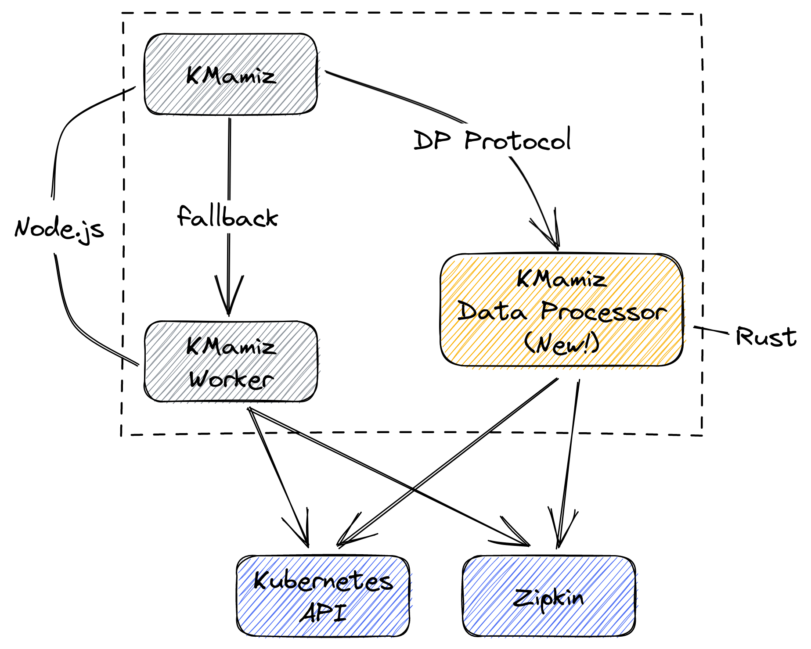

# KMamiz Data Processor

- [KMamiz Data Processor](#kmamiz-data-processor)
  - [Protocol](#protocol)
    - [KMamiz](#kmamiz)
    - [Data Processor](#data-processor)
  - [Rust-based Data Processor](#rust-based-data-processor)
  - [Build](#build)
  - [Usage](#usage)


## Protocol
To allow offloading the data processing, I proposed a Data Processor Protocol (DP Protocol) as follows.

### KMamiz
KMamiz will send a request to the DP whenever the Realtime Schedule triggers. The request contains the following schema:
```typescript
export type TExternalDataProcessorRequest = {
  uniqueId: string;
  lookBack: number; // u64
  time: number; // u64
  existingDep?: TEndpointDependency[];
};
```
- `uniqueId` - The ID used to trace how long the operation ran.
- `lookBack` - The `lookback` field Zipkin API needs.
- `time` - The `endTs` field Zipkin API needs.
- `existingDep` - The current endpoint dependencies in the cache.

### Data Processor

Upon request, the DP will retrieve the necessary data and construct a response with the following schema:
```typescript
export type TExternalDataProcessorResponse = {
  uniqueId: string;
  combined: TCombinedRealtimeData[];
  dependencies: TEndpointDependency[];
  datatype: TEndpointDataType[];
  log: string;
};
```

The fields should be self-explanatory, data in the `log` field will be logged out to KMamiz's trace log level.

## Rust-based Data Processor

This is a rewrite of the logic originally ran in the Node.js worker process.  
The original worker is still there as a fallback. KMamiz will try to send requests to the external DP and fall back to the worker process if there is an error.



## Build
To build this Data Processor, simply run `./build.sh`.  
Everything would be built inside Docker, so no local dependency is required.

## Usage
To use this Data Processor with KMamiz, see [the deployment documentation](../deploy/README-DP.md) for more.
